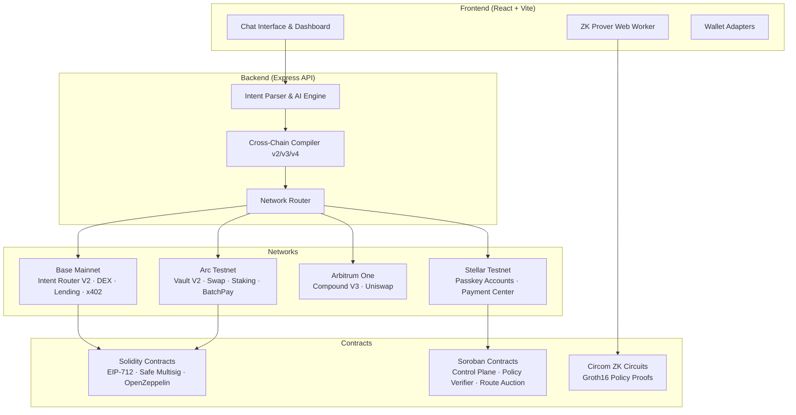

<p align="center">
  <h1 align="center">Kletia</h1>
  <p align="center">
    <strong>Intent-Driven Multichain DeFi Superapp</strong>
  </p>
  <p align="center">
    <a href="https://github.com/ArkMaster123/Kletia/actions/workflows/ci.yml"></a>
    <a href="LICENSE"></a>
    
    
    
    
  </p>
</p>

---

Kletia is an intent-driven multichain superapp. Describe the desired outcome in natural language — reviewed network adapters produce the exact quote, transaction, and evidence. AI interprets language but cannot invent calldata, XDR, contract identities, prices, or execution outcomes.

## Architecture



## Network Support

| Network | Status | Capabilities |
|---------|--------|-------------|
| **Base Mainnet** | Production | DeFi aggregation, DEX swaps (Uniswap V2/V3, Aerodrome), lending (Aave), token launches, x402 micropayments, ENS/Basename resolution, portfolio management |
| **Arc Testnet** | Testnet | Native-USDC programmable money: savings vault, AMM swap, lending, staking, batch payroll, memo transfers, gasless meta-transactions |
| **Arbitrum One** | Public Beta | Capability-gated DeFi expansion via Compound V3 and Uniswap |
| **Stellar Testnet** | Testnet | Passkey smart accounts (WebAuthn secp256r1), SEP-38 live FX discovery, SEP-24 hosted withdrawals, SEP-45 contract auth, CCTP bridge |

> Production and testnet capital lanes never share a workflow. Cross-chain steps are checkpointed and separately signed. A timeout recovers the existing transaction instead of silently resending funds.

## Key Features

- **Natural Language Intents** — Describe outcomes in plain English; deterministic grammar fallback ensures reliable parsing
- **Cross-Chain Execution** — Atomic checkpointing across chains via CCTP and Across bridge with replay protection
- **Zero-Knowledge Policy Proofs** — Client-side Groth16 zk-SNARK generation for private transaction policies (amounts, limits, recipients)
- **Non-Custodial Settlement** — EIP-712 signed intents settled through codehash-verified on-chain routers
- **Passkey Smart Accounts** — WebAuthn secp256r1 accounts on Stellar — no seed phrases, no browser extensions
- **x402 Micropayments** — HTTP 402 payment-gated AI agent API discovery, testing, and settlement
- **Real-World Payment Rails** — Stellar SEP-38/24 anchor integration for fiat off-ramp via reviewed providers
- **Security-First** — Prompt secret filtering, browser egress guards, codehash assertions, rate limiting, and risk scoring

## Repository Structure

```text
kletia/
├── apps/
│   ├── api/                  # Express backend — intent parsing, quotes, execution orchestration
│   └── web/                  # React SPA — multi-chain dashboard, chat interface, ZK prover
├── contracts/
│   ├── base/                 # Base Mainnet Solidity — Intent Router V2, Launch Factory, x402
│   ├── arc/                  # Arc Testnet Solidity — Vault V2, Swap, Lending, Staking, BatchPay
│   └── stellar/              # Stellar Soroban Rust — Control Plane, Policy Verifier, Route Auction
├── circuits/
│   └── stellar-policy/       # Circom ZK circuits — Groth16 policy constraints (V1 & V2)
├── docs/                     # Architecture specs, deployment guides, network documentation
│   ├── architecture/         # System overview, repository structure, competitive landscape
│   ├── deployment/           # Render & Vercel deployment runbooks
│   ├── networks/             # Per-network guides (Arbitrum, Base, Stellar)
│   ├── runbooks/             # Operational testing procedures
│   └── research/             # Research proposals and experiments
├── tooling/                  # Repository validation, privacy checks, release verification
├── attachments/              # Hackathon submissions, pitch decks, team documentation
└── .github/                  # CI workflows, issue templates, PR template
```

## Prerequisites

- **Node.js** 22.23.1 (see `.nvmrc`)
- **npm** (included with Node.js)
- **EVM Wallet** — MetaMask, Rabby, or any WalletConnect-compatible wallet for Base, Arc, and Arbitrum
- **WebAuthn Browser** — Chrome, Safari, or Firefox on `localhost` or HTTPS for Stellar passkey accounts
- **Freighter** *(optional)* — For Classic Stellar XLM/USDC tools

## Quick Start

### 1. Clone & Configure

```bash
git clone https://github.com/ArkMaster123/Kletia.git
cd Kletia

# Copy environment templates
cp apps/api/.env.example apps/api/.env
cp apps/web/.env.example apps/web/.env
```

### 2. Install Dependencies

```bash
npm --prefix apps/api ci --legacy-peer-deps
npm --prefix apps/web ci --legacy-peer-deps
```

### 3. Configure Environment

Edit `apps/api/.env` with your API keys:

| Variable | Required | Description |
|----------|----------|-------------|
| `BASE_RPC_URL` | Yes | Base Mainnet RPC endpoint (e.g., Alchemy, Infura) |
| `OPENROUTER_API_KEY` | Yes | OpenRouter API key for intent parsing |
| `ALCHEMY_API_KEY` | Recommended | Alchemy API key for enhanced RPC |
| `ACROSS_API_KEY` | For bridges | Across Protocol API key for cross-chain routes |
| `ALLORA_API_KEY` | Optional | Allora Network AI price predictions |
| `WEBACY_API_KEY` | Optional | Webacy wallet threat intelligence |

See [`apps/api/.env.example`](apps/api/.env.example) for the complete variable reference.

### 4. Start Development Servers

```bash
# Terminal 1: API server
npm run dev:mvp:api

# Terminal 2: Frontend
npm run dev:mvp:web
```

Open [http://localhost:5174](http://localhost:5174). Use `localhost` (not `127.0.0.1`) for WebAuthn passkey compatibility.

## Verification & Testing

Kletia uses a layered verification system:

```bash
# Core product verification (structure + typecheck + build + lint + compile)
npm run verify

# Extended labs verification (Stellar research, ZK circuits, policy workflows)
npm run verify:labs

# Full verification suite
npm run verify:all
```

Individual checks:

| Command | Scope |
|---------|-------|
| `npm run check:structure` | Repository structure invariants |
| `npm run typecheck:api` | Backend TypeScript type checking |
| `npm run typecheck:web` | Frontend TypeScript type checking |
| `npm run lint:web` | Frontend ESLint |
| `npm run build:api` | Backend production build |
| `npm run build:web` | Frontend production build |
| `npm run compile:base` | Base Mainnet Solidity compilation |
| `npm run compile:arc` | Arc Testnet Solidity compilation |

## Smart Contracts & Deployments

### Base Mainnet

| Contract | Address | Description |
|----------|---------|-------------|
| KletiaIntentRouterV2 | `0xf9BaA05c71c2078A43f6831Eca88220b42932413` | EIP-712 exact-input intent settlement router |
| KletiaLaunchFactoryV2 | `0x1D62Ac5e19af7688EbC57f262bbB9959dd78e043` | Safe-governed ERC-20 token launch factory |
| X402AttestationRegistry | `0xE69DE5A5E92F4a52b15C651C1C1fc0fE36143889` | HTTP 402 payment attestation registry |
| Governance Safe | `0x84f19Fdfd8C50C6349BFe86Cd90BE131387ab47D` | 2-of-2 multisig contract owner |

### Arc Testnet

| Contract | Address | Description |
|----------|---------|-------------|
| KletiaArcVaultV2 | `0xBe385e3520C20D44697CC1bEEDc9DF759C3A184d` | Solvency-guaranteed native USDC savings vault |

See [`contracts/base/README.md`](contracts/base/README.md) and [`contracts/arc/README.md`](contracts/arc/README.md) for complete deployment details.

## Deployment

Kletia deploys as two services:

| Service | Platform | Domain | Build |
|---------|----------|--------|-------|
| Backend API | Render | `api.kletiaai.xyz` | `npm run build` → `npm start` |
| Frontend SPA | Render / Vercel | `kletiaai.xyz` | `npm run build` → static `./dist` |

Configuration details:
- [Render Deployment Guide](docs/deployment/render.md)
- [Vercel Deployment Guide](docs/deployment/vercel.md)

## Documentation

| Document | Description |
|----------|-------------|
| [Architecture Overview](docs/architecture/overview.md) | System design, component relationships, data flow |
| [Repository Structure](docs/architecture/repository-structure.md) | Detailed directory layout and conventions |
| [Base DeFi Registry](docs/networks/base-defi-registry.md) | Supported Base protocols and integration details |
| [Stellar System Guide](docs/networks/stellar/system-guide.md) | Stellar integration architecture and boundaries |
| [Stellar Payment Center](docs/networks/stellar/payment-center-architecture.md) | SEP-38/24/45 payment center design |
| [Arbitrum Workflow](docs/networks/arbitrum-workflow.md) | Arbitrum capability-gated DeFi workflows |
| [MVP Test Runbook](docs/runbooks/mvp-live-test.md) | Step-by-step live testing procedures |

## Security

- **Non-custodial**: Kletia never holds user funds. All transactions are wallet-signed.
- **Codehash verification**: On-chain bytecode is verified against pinned hashes before every execution.
- **Prompt filtering**: User inputs are scanned for private keys, seed phrases, and PEM headers before reaching any LLM.
- **Egress protection**: Browser-side DOM observers and fetch interceptors block unauthorized data exfiltration.

For responsible disclosure, see [SECURITY.md](SECURITY.md).

## Contributing

We welcome contributions! Please read our [Contributing Guidelines](CONTRIBUTING.md) and [Code of Conduct](CODE_OF_CONDUCT.md) before getting started.

## License

Kletia is licensed under the [MIT License](LICENSE).

Copyright © 2026 Kletia Omni-Engine
