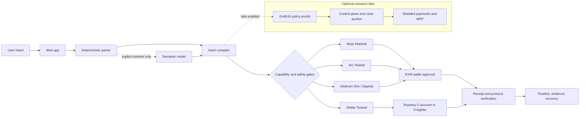
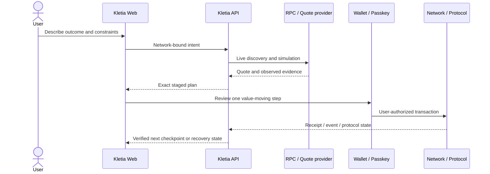

<p align="center">
  
</p>

<h1 align="center">Kletia</h1>

<p align="center">
  <strong>Intent-driven, evidence-aware multichain finance.</strong>
</p>

<p align="center">
  Kletia turns a natural-language financial goal into reviewed network-specific steps, keeps every value-moving action under the user's wallet or passkey approval, and verifies the result with chain and protocol evidence.
</p>

<p align="center">
  <a href="https://github.com/furkan3152/Kletia/actions/workflows/ci.yml"></a>
  <a href="LICENSE"></a>
  
  
  
  
</p>

> [!IMPORTANT]
> Kletia is a development-stage multichain MVP. It includes public Base Mainnet deployments and real Testnet transactions, but it is not an audited universal settlement protocol. Testnet evidence, successful builds, provider discovery, and production readiness are different claims. The runtime fails closed when required identity, quote, simulation, persistence, or provider evidence is unavailable.

## What Kletia does

- Interprets simple and staged intents while keeping contract identities, calldata, XDR, quotes, and success decisions deterministic.
- Resolves assets by network-specific identity: EVM chain and contract, or Stellar network, code, issuer, and SAC.
- Compares reviewed routes using output, gas, fees, slippage, time, risk, and disclosure cost.
- Presents approvals, bridge checkpoints, protocol actions, and recovery as explicit user-authorized steps.
- Treats `indeterminate` as a real state: an uncertain transaction is recovered by its existing hash or nonce, never silently resent.
- Separates private planning, ZK policy proof, public execution, and shielded-payment claims instead of calling every privacy feature the same thing.

## System architecture



The browser owns presentation, private-field handling, wallet bindings, passkey ceremonies, and final transaction review. The API owns semantic interpretation, canonical registries, live discovery, route construction, simulation policy, durable workflow state, and evidence verification. Network modules share safety primitives, but never inherit another network's asset or contract identities.

### Intent lifecycle



Cross-chain workflows are checkpointed, not globally atomic. A later step is prepared only after the previous network or protocol result satisfies its specific evidence rules.

## Network and capability matrix

| Network | Lane | Implemented surface | Current boundary |
|---|---|---|---|
| **Base Mainnet** (`8453`) | Production capital lane | Portfolio, reviewed swap execution through Intent Router V2, lending/vault discovery, token launch, Basenames, x402, security integrations | Contracts are publicly deployed and identity-pinned; this is not an audit or a guarantee that every discovered protocol route is executable |
| **Arbitrum One** (`42161`) | Production capital lane | Uniswap V3 and Aave V3 adapters, portfolio and risk reads, staged Base-to-Arbitrum workflows | Public Beta behind independent API and web capability gates |
| **Arc Testnet** (`5042002`) | Testnet lane | Native-USDC swap, lending, staking, Vault V2, memo and batch payments, Circle/App Kit planning | Testnet-only deployed contracts; native-value and ERC-20 USDC decimal rails remain distinct |
| **Stellar Testnet** | Testnet lane | XLM/USDC balances, trustlines, Classic payments, SDEX, secp256r1 WebAuthn C-accounts, Payment Center orchestration | Passkey flow has real Testnet transaction evidence; no reviewed real-world payout provider currently satisfies the full release gate |
| **Arbitrum Sepolia** (`421614`) | Testnet endpoint | Circle Testnet USDC and reviewed Aave supply workflow | Used by the Arc/CCTP test corridor; borrowing remains read-only capacity in the MVP |

Production and Testnet capital never share one workflow. A registry entry means “known identity,” not automatic support for every action.

## Core release and research labs

Kletia deliberately separates the testable product from heavier research surfaces.

| Profile | Included | Command | Meaning |
|---|---|---|---|
| **Core** | API/web, four network profiles, intent tests, privacy egress, Payment Center boundaries, Base/Arc compilation | `npm run verify:core` | Required CI and public-release source gate |
| **Labs** | Policy V1/V2, Circom proofs, Soroban control plane, route auction, solver reference process, private payments, MPP, V3/V4 research workflows | `npm run verify:labs` | Reproducible research; not a substitute for provider or funded execution evidence |
| **Live preflight** | RPC, contract identity, durable store, passkey and provider readiness | `npm run verify:mvp-live` | Expected to fail closed until every required live dependency is configured |

The reference solver coordinates lab auction records; it does not secretly fund or execute Arc/EVM transactions. The reviewed staged executor remains wallet-controlled.

## Repository map

```text
apps/
  api/                    Express API, intent compiler, adapters, workflows, evidence
  web/                    React/Vite application, wallets, passkeys, timelines, ZK workers
contracts/
  base/                   Base Mainnet Solidity contracts and deployment evidence
  arc/                    Arc Testnet Solidity contracts and migration evidence
  stellar/                Soroban contracts and Testnet deployment manifests
circuits/stellar-policy/  Circom policy circuits and reproducible development artifacts
docs/                     Architecture, network, deployment, runbook, and research records
tooling/                  Repository, privacy, workflow, circuit, and release gates
attachments/              Path- and hash-stable submission material
```

See the [documentation index](docs/README.md) and [repository ownership rules](docs/architecture/repository-structure.md) before moving modules. Submission attachments and deployment manifests are path-sensitive.

## Local development

### Prerequisites

- Node.js **22.23.1** (`.nvmrc`)
- npm shipped with that Node release
- A modern WebAuthn browser on `localhost` or HTTPS for Stellar passkeys
- An EVM wallet for Base, Arc, and Arbitrum value-moving tests
- Freighter only for Classic Stellar flows that explicitly require it
- Rust, Cargo, and the Stellar CLI only for Soroban labs and contract work

### Install

```bash
git clone https://github.com/furkan3152/Kletia.git
cd Kletia
nvm use

npm --prefix apps/api ci --include=dev --legacy-peer-deps
npm --prefix apps/web ci --include=dev --legacy-peer-deps
npm --prefix contracts/base ci --include=dev --legacy-peer-deps
npm --prefix contracts/arc ci --include=dev --legacy-peer-deps
```

The repository intentionally has no root workspace lockfile. Each JavaScript package owns its lockfile and must be installed independently. Labs that exercise the Circom workspace also require:

```bash
npm --prefix circuits/stellar-policy ci --include=dev
```

### Configure

```bash
cp apps/api/.env.example apps/api/.env
cp apps/web/.env.example apps/web/.env
```

Use [the API environment template](apps/api/.env.example) as the complete reference. At minimum, configure the RPCs for the networks you intend to test. `OPENROUTER_API_KEY` is optional: deterministic intents continue to work without it, while unsupported wording remains fail-closed instead of being sent to a model. Browser `VITE_*` values are public and must never contain secrets.

### Run

```bash
# Terminal 1 — core API
npm run dev:mvp:api

# Terminal 2 — web app on the passkey-compatible origin
npm run dev:mvp:web
```

Open [http://localhost:5174](http://localhost:5174). Use the labs API only when intentionally evaluating research surfaces:

```bash
npm run dev:labs:api
npm run dev:mvp:solver
```

## Verification

```bash
# CI-equivalent product gate
npm run verify

# Research contracts, circuits, stores, and browser surfaces
npm run verify:labs

# Everything reproducible from the repository
npm run verify:all

# Live, no-mock dependency preflight
npm run verify:mvp-live
```

| Evidence | What it proves | What it does not prove |
|---|---|---|
| Typecheck/build/test | The checked source path is reproducible | Live liquidity, funded execution, or security |
| Deployment manifest and codehash | Exact observed contract identity | Contract correctness or audit status |
| Live readiness | Configured dependency is reachable and identity-bound | A user completed the financial lifecycle |
| Confirmed transaction plus protocol evidence | That exact operation reached the verified state | Mainnet safety or every future operation |
| Provider completion evidence | That provider reported the off-chain terminal state | Independent banking finality unless separately verified |

The end-to-end operator procedure is in the [real-data MVP runbook](docs/runbooks/mvp-live-test.md).

## Public deployments and evidence

- Base V2 identities: [`contracts/base/deployments/base-mainnet-v2.json`](contracts/base/deployments/base-mainnet-v2.json)
- Arc Testnet identities: [`contracts/arc/deployments/arc-testnet.json`](contracts/arc/deployments/arc-testnet.json)
- Stellar passkey smoke evidence: [`contracts/stellar/deployments/testnet/passkey-smoke.v1.json`](contracts/stellar/deployments/testnet/passkey-smoke.v1.json)
- Stellar control-plane and solver research manifests: [`contracts/stellar/deployments/testnet`](contracts/stellar/deployments/testnet/control-plane.v2.json)
- Render service definition: [`render.yaml`](render.yaml)

The public application is [kletiaai.xyz](https://kletiaai.xyz) and the API is [api.kletiaai.xyz](https://api.kletiaai.xyz). A public deployment can lag the repository; verify its readiness endpoints and deployed commit before treating it as evidence for `main`.

## Security model

- Kletia does not hold user funds or embed user/deployer private keys in the API or browser bundle.
- AI may interpret language only with the applicable disclosure consent; it cannot choose trusted identities or produce execution truth.
- Plans bind request, account, network, asset, target, amount, deadline, and calldata/XDR evidence.
- Approvals use exact reviewed spenders; network and account changes invalidate prepared actions.
- A transaction hash alone is not completion. Receipt, event, amount, nonce, and protocol post-state rules are action-specific.
- External quotes, RPCs, paid x402 bodies, anchor pages, and model output remain untrusted inputs.

This repository and its Testnet contracts have not been presented as independently audited. Do not use unaudited paths with funds you cannot afford to lose. Report vulnerabilities according to [SECURITY.md](SECURITY.md).

## Documentation

Start with [docs/README.md](docs/README.md). The main technical entry points are:

- [Architecture overview](docs/architecture/overview.md)
- [Repository structure and ownership](docs/architecture/repository-structure.md)
- [Base DeFi registry](docs/networks/base-defi-registry.md)
- [Arbitrum workflow](docs/networks/arbitrum-workflow.md)
- [Stellar system guide](docs/networks/stellar/system-guide.md)
- [Stellar Payment Center architecture](docs/networks/stellar/payment-center-architecture.md)
- [Render release runbook](docs/deployment/render.md)
- [MVP live-test runbook](docs/runbooks/mvp-live-test.md)

## Contributing and license

Read [CONTRIBUTING.md](CONTRIBUTING.md) and [CODE_OF_CONDUCT.md](CODE_OF_CONDUCT.md) before opening a pull request. Kletia source is available under the [MIT License](LICENSE); third-party and research dependencies retain their own licenses and notices.
