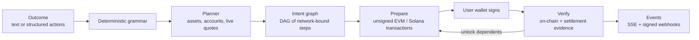
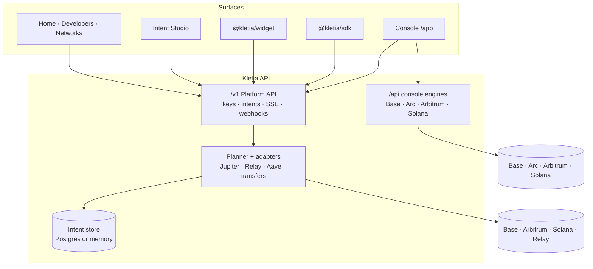

<p align="center">
  
</p>

<h1 align="center">Kletia</h1>

<p align="center">
  <strong>Intent infrastructure for EVM and Solana.</strong>
</p>

<p align="center">
  Say the outcome — Kletia compiles it into verified, wallet-signed steps across Base, Arbitrum, Arc and Solana.<br>
  Use it as an app, or put cross-network intents into your own product with one API, SDK and widget.
</p>

<p align="center">
  <a href="https://github.com/furkan3152/Kletia/actions/workflows/ci.yml"></a>
  <a href="LICENSE"></a>
  
  
  
</p>

> [!IMPORTANT]
> Kletia is non-custodial and fail-closed, with public Base Mainnet deployments and live Solana, Relay and Jupiter integrations. It has not been independently audited. Builds, quotes, testnet evidence and funded production execution are different claims; see the [security model](#security-model).

## Why Kletia

Moving value across chains still means juggling bridges, DEXs, wallets, token addresses and failure modes by hand — and every product that wants to offer it rebuilds the same fragile plumbing.

Kletia turns an outcome into an **intent graph**: a DAG of network-bound steps, each quoted live, signed in the user's own wallet and advanced only on on-chain or settlement-network evidence.

```text
"bridge 50 USDC from base to solana then swap half to JitoSOL"

  s1  Base     USDC ──Relay──▶ Solana USDC     approve + deposit (EVM wallet)
  s2  Solana   USDC ──Jupiter─▶ JitoSOL        1 transaction (Solana wallet)
      └── s2 unlocks only after s1's destination fill is verified
```

| For | Kletia gives you |
|---|---|
| **Users** | One console for Base, Arbitrum, Arc and Solana: swaps, bridges, staking, lending, transfers, portfolio and activity — with EVM and Solana wallets connected at once. |
| **Builders** | Platform API v1, a typed SDK and a drop-in React widget: plan, quote, execute and track cross-network intents without running bridge, DEX or wallet plumbing. |
| **Agents** | Deterministic intent compilation, x402 pay-per-call and REST — a safe execution surface for autonomous software that still never holds keys. |

## Build with Kletia

```bash
npm install @kletia/sdk
```

```ts
import { KletiaClient, executeIntent, eip1193Signer, walletStandardSolanaSigner, formatAccountId } from "@kletia/sdk";

const kletia = new KletiaClient({ apiKey: process.env.KLETIA_API_KEY });

const intent = await kletia.intents.create({
  text: "bridge 25 USDC from base to solana then swap half to JitoSOL",
  accounts: [formatAccountId("base", evmAddress), formatAccountId("solana", solanaAddress)],
  constraints: { maxSlippageBps: 50 },
});

await executeIntent(kletia, intent, {
  evm: eip1193Signer(window.ethereum, evmAddress),
  solana: walletStandardSolanaSigner(phantom, phantomAccount, "solana:mainnet"),
});
```

Or over REST:

```bash
curl -X POST https://api.kletiaai.xyz/v1/intents?dryRun=true \
  -H 'content-type: application/json' \
  -d '{"text":"swap 1 SOL to USDC","accounts":["solana:5eykt4UsFv8P8NJdTREpY1vzqKqZKvdp:9WzDXwBbmkg8ZTbNMqUxvQRAyrZzDsGYdLVL9zYtAWWM"]}'
```

Or as a component:

```tsx
<KletiaIntentWidget clientOptions={{ apiKey }} accounts={accounts} signers={signers} />
```

| Package | What it is |
|---|---|
| [`@kletia/core`](packages/core/README.md) | The intent specification: CAIP-2/10/19 identities, chain, asset and protocol registries, intent graph, lifecycle rules, validation, events, webhook signatures. Zero dependencies. |
| [`@kletia/sdk`](packages/sdk/README.md) | Typed client for Platform API v1, Server-Sent Events, EIP-1193 and Wallet Standard signers, `executeIntent`. |
| [`@kletia/widget`](packages/widget/README.md) | Embeddable React widget with scoped styles: plan, review and execute intents. |
| [Platform API v1](docs/platform/api-v1.md) | REST + SSE + signed webhooks, developer keys, OpenAPI at `/v1/openapi.json`. |

## How it works


```mermaid
flowchart LR
    A[Outcome<br/>text or structured actions] --> B[Deterministic grammar]
    B --> C[Planner<br/>assets, accounts, live quotes]
    C --> D[Intent graph<br/>DAG of network-bound steps]
    D --> E[Prepare<br/>unsigned EVM / Solana transactions]
    E --> F[User wallet signs]
    F --> G[Verify<br/>on-chain + settlement evidence]
    G -->|unlock dependents| E
    G --> H[Events<br/>SSE + signed webhooks]
```

1. **Express** — natural language or structured actions, plus the CAIP-10 accounts the user controls.
2. **Plan** — a deterministic compiler (no model in the execution path) resolves exact network identities, picks a venue, quotes it live, chains amounts through guaranteed minimum outputs and merges bridge + swap into one cross-network swap when possible.
3. **Sign** — every value-moving transaction is signed in the user's own wallet: EIP-1193 for EVM, Wallet Standard for Solana.
4. **Prove** — a step advances only when Kletia observes it on-chain from the bound account; cross-network steps settle only on a verified destination fill.

## Networks and venues

| Network | Lane | What runs today |
|---|---|---|
| **Base** (`eip155:8453`) | Production | Kletia Intent Router V2 swaps, Relay swaps and bridges, Aave V3 supply, lending and vault discovery, token launch (LaunchFactory V2), Basenames, x402 |
| **Arbitrum One** (`eip155:42161`) | Production | Uniswap V3 and Aave V3, Relay swaps and bridges, staged Base → Arbitrum workflows |
| **Solana** (`solana:5eykt4UsFv8P8NJdTREpY1vzqKqZKvdp`) | Production | Jupiter swaps, liquid staking (JitoSOL, mSOL, JupSOL), SOL/SPL/Token-2022 transfers, Relay bridges to Base and Arbitrum, Kamino rate discovery |
| **Arc Testnet** (`eip155:5042002`) | Testnet | Native-USDC swap, lending, staking, Vault V2, batch and memo payments, Circle App Kit |
| **Arbitrum Sepolia** (`eip155:421614`) | Testnet | Circle Testnet USDC and Aave supply |
| **Solana Devnet** | Testnet | Transfers and portfolio |

Production and testnet capital never share one intent. The full protocol registry lives in [`packages/core/src/protocols.ts`](packages/core/src/protocols.ts) and is served at `GET /v1/protocols`.

## Architecture


```mermaid
flowchart TB
    subgraph Surfaces
      Site[Home · Developers · Networks]
      Console[Console /app]
      Studio[Intent Studio]
      Widget["@kletia/widget"]
      SDK["@kletia/sdk"]
    end
    subgraph API[Kletia API]
      V1["/v1 Platform API<br/>keys · intents · SSE · webhooks"]
      Engine[Planner + adapters<br/>Jupiter · Relay · Aave · transfers]
      Store[(Intent store<br/>Postgres or memory)]
      AppApi["/api console engines<br/>Base · Arc · Arbitrum · Solana"]
    end
    Site & Studio & Widget & SDK --> V1
    Console --> V1
    Console --> AppApi
    V1 --> Engine --> Store
    Engine --> Chains[(Base · Arbitrum · Solana · Relay)]
    AppApi --> Chains2[(Base · Arc · Arbitrum · Solana)]
```

The first-party app is built on the same API integrators use. See the [architecture overview](docs/architecture/overview.md).

## Repository

```text
packages/
  core/       Intent specification (zero dependencies)
  sdk/        TypeScript SDK
  widget/     React widget
apps/
  api/        Express API: /v1 platform (src/platform), console engines, network modules
  web/        React app: home, console, Studio, developer portal, networks status
contracts/
  base/       Base Mainnet Solidity contracts and deployment evidence
  arc/        Arc Testnet Solidity contracts and migration evidence
docs/         Architecture, platform API, networks, deployment and runbooks
tooling/      Repository, documentation and privacy verification gates
```

## Run it locally

Prerequisites: Node.js **22** (`.nvmrc` pins 22.23.1), an EVM wallet and a Solana wallet (Phantom, Solflare or Backpack) for value-moving tests.

```bash
git clone https://github.com/furkan3152/Kletia.git
cd Kletia
nvm use
npm ci                       # installs the workspace and builds @kletia/* packages

cp apps/api/.env.example apps/api/.env
cp apps/web/.env.example apps/web/.env

npm run dev:api              # http://localhost:3001  (/api and /v1)
npm run dev:web              # http://localhost:5174
```

Every feature that needs no secret works out of the box: public, identity-pinned deployments are applied as defaults and re-validated on-chain on every request. `GET /api/capabilities` lists anything that still needs an operator key (for example Webacy risk scoring, Allora, Across, CDP on-ramp) and the app shows it instead of hiding it.

## Verification

```bash
npm run verify          # structure, docs, privacy gates, package tests, typecheck,
                        # builds, intent matrices, lint, contract compilation
npm run verify:mvp-live # live, no-mock dependency preflight
```

| Evidence | What it proves | What it does not prove |
|---|---|---|
| Typecheck / build / tests | The checked source path is reproducible | Live liquidity, funded execution or security |
| Deployment manifest and codehash | Exact observed contract identity | Contract correctness or audit status |
| Live readiness | A configured dependency is reachable and identity-bound | That a user completed the financial lifecycle |
| Verified transaction + settlement evidence | That exact operation reached the verified state | Mainnet safety of every future operation |

## Security model

- **Non-custodial.** The API returns unsigned transactions; users sign every value-moving step. Kletia never holds keys.
- **Deterministic execution.** Model output (only with explicit consent, console only) can never choose a target, amount or success.
- **Evidence over assertions.** Sender or fee payer, target, chain and status are verified on-chain; cross-network steps need a destination fill.
- **Exactness.** Assets resolve by network identity, approvals are exact, prepared payloads expire and are bound to their quote.
- **Fail closed.** Missing RPC, quote, simulation or credential disables a feature; it never becomes a mock result. Uncertain transactions are recovered, never resent.
- **Untrusted inputs.** Quotes, RPCs, relayers, solvers, x402 responses and model output stay untrusted until their checks pass.

Report vulnerabilities privately as described in [SECURITY.md](SECURITY.md).

## Public deployments

- Base Intent Router V2, LaunchFactory V2 and attestation registry: [`contracts/base/deployments/base-mainnet-v2.json`](contracts/base/deployments/base-mainnet-v2.json)
- Arc Testnet identities: [`contracts/arc/deployments/arc-testnet.json`](contracts/arc/deployments/arc-testnet.json)
- Service topology: [`render.yaml`](render.yaml)

The app runs at [kletiaai.xyz](https://kletiaai.xyz) and the API at [api.kletiaai.xyz](https://api.kletiaai.xyz). A public deployment can lag the repository; check its readiness endpoints before treating it as evidence for `main`.

## Documentation

Start with the [documentation index](docs/README.md): [architecture](docs/architecture/overview.md), [repository structure](docs/architecture/repository-structure.md), [Platform API v1](docs/platform/api-v1.md), [Solana](docs/networks/solana.md), [Base DeFi registry](docs/networks/base-defi-registry.md), [Arbitrum workflow](docs/networks/arbitrum-workflow.md), [Render](docs/deployment/render.md) and [Vercel](docs/deployment/vercel.md) deployment.

## Contributing and license

Read [CONTRIBUTING.md](CONTRIBUTING.md) and the [Code of Conduct](CODE_OF_CONDUCT.md). Kletia is available under the [MIT License](LICENSE); third-party dependencies retain their own licenses.
