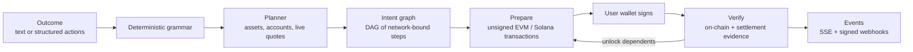
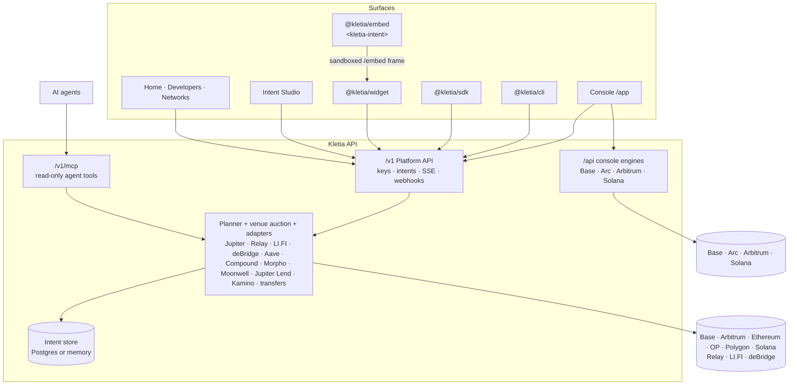

<p align="center">
  
</p>

<h1 align="center">Kletia</h1>

<p align="center">
  <strong>Intent infrastructure for EVM and Solana.</strong>
</p>

<p align="center">
  Say the outcome — Kletia compiles it into verified, wallet-signed steps across Base, Arbitrum, Ethereum, OP Mainnet, Polygon, Arc and Solana.<br>
  Use it as an app, or put cross-network intents into your own product with one API, SDK, React widget, web component, CLI and MCP server.
</p>

<p align="center">
  <a href="https://github.com/furkan3152/Kletia/actions/workflows/ci.yml"></a>
  <a href="LICENSE"></a>
  
  
  
</p>

> [!IMPORTANT]
> Kletia is non-custodial and fail-closed, with public Base Mainnet deployments and live Solana, Jupiter, Relay, LI.FI, deBridge and lending integrations. It has not been independently audited. Builds, quotes, testnet evidence and funded production execution are different claims; see the [security model](#security-model).

## Why Kletia

Moving value across chains still means juggling bridges, DEXs, wallets, token addresses and failure modes by hand — and every product that wants to offer it rebuilds the same fragile plumbing.

Kletia turns an outcome into an **intent graph**: a DAG of network-bound steps, each quoted live, signed in the user's own wallet and advanced only on on-chain or settlement-network evidence.

```text
"bridge 50 USDC from base to solana then swap half to JitoSOL"

  s1  Base     USDC ──Relay──▶ Solana USDC     approve + deposit (EVM wallet)
  s2  Solana   USDC ──Jupiter─▶ JitoSOL        1 transaction (Solana wallet)
      └── s2 unlocks only after s1's destination fill is verified
```

| For | Kletia gives you |
|---|---|
| **Users** | One console for Base, Arbitrum, Arc and Solana: swaps, bridges, staking, lending, transfers, portfolio and activity — with EVM and Solana wallets connected at once. |
| **Builders** | Platform API v1 (with OpenAPI and a Postman collection), a typed SDK with webhook helpers, a drop-in React widget and hooks, a `<kletia-intent>` web component and a CLI: plan, quote, execute and track cross-network intents without running bridge, DEX, lending or wallet plumbing. |
| **Agents** | A read-only MCP server at `/v1/mcp`, deterministic intent compilation, x402 pay-per-call and REST — a safe planning surface for autonomous software that never holds keys and hands signing to the user. |

## Infrastructure

Every surface below talks to the same Platform API v1 and the same planner the
Kletia app uses. None of them holds keys or signs: value-moving transactions are
always signed in the user's own wallet.

| Surface | Use it for |
|---|---|
| [Platform API v1](docs/platform/api-v1.md) | REST + Server-Sent Events + signed webhooks: plan, quote, prepare, submit and track intents. Developer keys with rotation and revocation, `Idempotency-Key`, usage, lending venue rates (`/v1/venues`), an [error catalog](docs/platform/errors.md) and a status badge. Machine-readable as [OpenAPI 3.1](docs/platform/openapi.json) (also `GET /v1/openapi.json`) and a [Postman collection](docs/platform/collections/README.md). |
| [`@kletia/sdk`](packages/sdk/README.md) | Typed TypeScript client with retries and idempotency keys, SSE, `intents.wait`, EIP-1193 and Wallet Standard signers and `executeIntent`; `@kletia/sdk/server` verifies webhooks for fetch runtimes, Next.js, Hono, Express and `node:http`. |
| [`@kletia/widget`](packages/widget/README.md) | Drop-in React widget with scoped styles, and `@kletia/widget/hooks` (`useKletiaIntent`, `useIntent`, `useQuote`, …) for your own UI. |
| [`@kletia/embed`](packages/embed/README.md) | The `<kletia-intent>` web component for any page, framework or not: a sandboxed frame that sizes itself and reports progress as DOM events. |
| [`@kletia/cli`](packages/cli/README.md) | `kletia` on the command line: quote, plan (dry run), watch intents, manage keys and webhooks, forward webhooks to localhost. |
| [MCP server](docs/platform/mcp.md) | `/v1/mcp`: read-only tools (`get_quote`, `plan_intent`, `get_portfolio`, …) for AI agents, with a Studio hand-off link so the user signs. |
| [Self-hosting](docs/deployment/self-hosting.md) | Docker Compose with PostgreSQL, and API and web images on GHCR with provenance and an SBOM. |

The npm packages are released together from a `packages-v*` tag
([release workflow](.github/workflows/release-packages.yml)); until the first
release is on npm, use them from this workspace (`npm ci` builds them).

### REST

```bash
curl -X POST 'https://api.kletiaai.xyz/v1/intents?dryRun=true' \
  -H 'content-type: application/json' \
  -d '{"text":"swap 1 SOL to USDC","accounts":["solana:5eykt4UsFv8P8NJdTREpY1vzqKqZKvdp:9WzDXwBbmkg8ZTbNMqUxvQRAyrZzDsGYdLVL9zYtAWWM"]}'
```

The public tier needs no key. A developer key (`POST /v1/keys`) raises the
rate limit and unlocks listing, webhooks and usage; keep it on your server.

### SDK

```bash
npm install @kletia/sdk
```

```ts
import { KletiaClient, executeIntent, eip1193Signer, walletStandardSolanaSigner, formatAccountId } from "@kletia/sdk";

// Browser code: keyless public tier (or a `baseUrl` proxied through your server).
// `apiKey` (kl_dev_…) is for server-side code only; never ship it in a bundle.
const kletia = new KletiaClient();

const intent = await kletia.intents.create({
  text: "bridge 25 USDC from base to solana then swap half to JitoSOL",
  accounts: [formatAccountId("base", evmAddress), formatAccountId("solana", solanaAddress)],
  constraints: { maxSlippageBps: 50 },
});

await executeIntent(kletia, intent, {
  evm: eip1193Signer(window.ethereum, evmAddress),
  solana: walletStandardSolanaSigner(phantom, phantomAccount, "solana:mainnet"),
});
```

Webhooks on your server (Next.js App Router shown; Hono, Express and
`node:http` handlers are in the same module):

```ts
import { createWebhookHandler } from "@kletia/sdk/server";

export const POST = createWebhookHandler({
  secret: process.env.KLETIA_WEBHOOK_SECRET!,
  onEvent: async (event) => {
    if (event.type === "intent.status_changed") await markOrder(event);
  },
});
```

### React widget and hooks

```tsx
import { KletiaIntentWidget } from "@kletia/widget";

<KletiaIntentWidget accounts={accounts} signers={signers} onComplete={(intent) => console.log(intent.status)} />;
```

`@kletia/widget/hooks` exposes the same flow without the UI:
`const { plan, execute, intent, phase } = useKletiaIntent({ accounts, signers })`.

### Web component

No framework and no build step: one script (pin the version and add its
[Subresource Integrity hash](docs/platform/embed.md#quick-start)) and one element.

```html
<script
  src="https://cdn.jsdelivr.net/npm/@kletia/embed@0.1.0/dist/kletia-embed.min.js"
  integrity="sha384-…"
  crossorigin="anonymous"
></script>

<kletia-intent text="swap 1 SOL to USDC" reference="order-42"></kletia-intent>

<script>
  document.addEventListener("kletia:completed", (event) => {
    // A hint, not a payment: confirm with GET /v1/intents/:id on your server.
    console.log(event.detail.intentId, event.detail.status);
  });
</script>
```

The element renders the hosted `/embed` page in a sandboxed frame and connects
to it over a `MessageChannel` bound to Kletia's origin; your page receives ids,
statuses and heights, never calldata, addresses or amounts. A plain
`<iframe src="https://kletiaai.xyz/embed">` still works; see the
[embed guide](docs/platform/embed.md).

### CLI

```bash
npx @kletia/cli quote 25 USDC --from base --to solana
npx @kletia/cli plan "bridge 25 USDC from base to solana then swap half to JitoSOL" \
  --account base:0xYourEvmAddress --account solana:YourSolanaAddress
```

### MCP for agents

```bash
claude mcp add --transport http kletia https://api.kletiaai.xyz/v1/mcp
```

Agents can list networks, quote, dry-run plans and read intents and balances.
No tool moves funds: `create_signing_link` hands the user a Studio link where
their own wallet plans again and signs.

### Self-hosting and images

```bash
export KLETIA_PLATFORM_SECRET=$(openssl rand -hex 32)
docker compose up --build          # PostgreSQL + API (:3001) + web (:10000)
```

[`images.yml`](.github/workflows/images.yml) publishes
`ghcr.io/furkan3152/kletia-api` and `ghcr.io/furkan3152/kletia-web` for every
push to `main` (`main`, `sha-<commit>`) and every `v*` release tag
(`<version>`, `<major>.<minor>`, `latest`), with SLSA provenance and an SPDX
SBOM attached. Set `KLETIA_API_IMAGE` and `KLETIA_WEB_IMAGE` to run them through
the same Compose file; see [self-hosting](docs/deployment/self-hosting.md).

## What makes it different

- **Bring your own contract.** Register a contract or Solana Action; Kletia simulates every call, pins its code, and shows the user a clear review ([docs](docs/platform/contracts.md)).
- **Fare breakdown.** Before signing, the user sees every asset change on every network, labelled by how sure Kletia is ([docs](docs/platform/preview.md)).
- **Verifiable receipts.** Signed, selectively disclosable, checkable offline or against public RPCs ([docs](docs/platform/receipts.md)).
- **Rule Book.** Spending rules for projects, keys and AI agents, with approvals by wallet signature ([docs](docs/platform/policies.md)).
- **Intent links.** A link that carries a bounded intent to anyone's wallet ([docs](docs/platform/links.md)).

Kletia has not had an external security audit.

## How it works


```mermaid
flowchart LR
    A[Outcome<br/>text or structured actions] --> B[Deterministic grammar]
    B --> C[Planner<br/>assets, accounts, live quotes]
    C --> D[Intent graph<br/>DAG of network-bound steps]
    D --> E[Prepare<br/>unsigned EVM / Solana transactions]
    E --> F[User wallet signs]
    F --> G[Verify<br/>on-chain + settlement evidence]
    G -->|unlock dependents| E
    G --> H[Events<br/>SSE + signed webhooks]
```

1. **Express** — natural language or structured actions, plus the CAIP-10 accounts the user controls. Recipients may be addresses or ENS, Basenames and SNS names.
2. **Plan** — a deterministic compiler (no model in the execution path) resolves exact network identities, picks a venue, quotes it live, chains amounts through guaranteed minimum outputs and merges bridge + swap into one cross-network swap when possible. Cross-network steps run an auction between Relay, LI.FI and deBridge DLN on guaranteed output net of fees, then time.
3. **Sign** — every value-moving transaction is signed in the user's own wallet: EIP-1193 for EVM, Wallet Standard for Solana.
4. **Prove** — a step advances only when Kletia observes it on-chain from the bound account; cross-network steps settle only on a verified destination fill.

## Networks and venues

| Network | Lane | What runs today |
|---|---|---|
| **Base** (`eip155:8453`) | Production | Kletia Intent Router V2 swaps, Relay swaps; bridges (Relay, LI.FI, deBridge DLN); Aave V3, Compound V3, Morpho vaults and Moonwell deposit/withdraw; token launch (LaunchFactory V2), Basenames, x402 |
| **Arbitrum One** (`eip155:42161`) | Production | Uniswap V3 and Relay swaps; bridges (Relay, LI.FI, deBridge DLN); Aave V3, Compound V3 and Morpho vaults; staged Base → Arbitrum workflows |
| **Ethereum** (`eip155:1`) | Production (intent platform) | Transfers, bridges (Relay, LI.FI, deBridge DLN), Aave V3, Compound V3 and Morpho vaults; ENS recipients |
| **OP Mainnet** (`eip155:10`) | Production (intent platform) | Transfers, bridges (Relay, LI.FI, deBridge DLN), Aave V3, Compound V3 and Moonwell |
| **Polygon PoS** (`eip155:137`) | Production (intent platform) | Transfers (POL and ERC-20), bridges (Relay, LI.FI; deBridge DLN from Polygon only when named, since its POL fee has no price source yet), Aave V3 |
| **Solana** (`solana:5eykt4UsFv8P8NJdTREpY1vzqKqZKvdp`) | Production | Jupiter swaps, liquid staking (JitoSOL, mSOL, JupSOL), SOL/SPL/Token-2022 transfers, Jupiter Lend and Kamino deposit/withdraw, bridges to every EVM network above (Relay, deBridge DLN; LI.FI into Solana), SNS recipients |
| **Arc Testnet** (`eip155:5042002`) | Testnet | Native-USDC swap, lending, staking, Vault V2, batch and memo payments, Circle App Kit |
| **Arbitrum Sepolia** (`eip155:421614`) | Testnet | Circle Testnet USDC and Aave supply |
| **Solana Devnet** | Testnet | Transfers and portfolio |

Production and testnet capital never share one intent. Every venue contract,
program, vault and market is pinned in the registry
([`packages/core/src/protocols.ts`](packages/core/src/protocols.ts): `PROTOCOLS`,
`YIELD_VENUES`, `VENUE_CONTRACTS`), re-checked on-chain before a payload is
built, and served at `GET /v1/protocols`. Network guides:
[Ethereum](docs/networks/ethereum.md), [OP Mainnet](docs/networks/optimism.md),
[Polygon](docs/networks/polygon.md), [Solana](docs/networks/solana.md) and
[cross-chain venues](docs/networks/cross-chain-venues.md).

## Architecture


```mermaid
flowchart TB
    subgraph Surfaces
      Site[Home · Developers · Networks]
      Console[Console /app]
      Studio[Intent Studio]
      Widget["@kletia/widget"]
      Embed["@kletia/embed<br/>&lt;kletia-intent&gt;"]
      SDK["@kletia/sdk"]
      CLI["@kletia/cli"]
    end
    subgraph API[Kletia API]
      V1["/v1 Platform API<br/>keys · intents · SSE · webhooks"]
      MCP["/v1/mcp<br/>read-only agent tools"]
      Engine[Planner + venue auction + adapters<br/>Jupiter · Relay · LI.FI · deBridge · Aave · Compound · Morpho · Moonwell · Jupiter Lend · Kamino · transfers]
      Store[(Intent store<br/>Postgres or memory)]
      AppApi["/api console engines<br/>Base · Arc · Arbitrum · Solana"]
    end
    Embed -->|"sandboxed /embed frame"| Widget
    Site & Studio & Widget & SDK & CLI --> V1
    Agents[AI agents] --> MCP --> Engine
    Console --> V1
    Console --> AppApi
    V1 --> Engine --> Store
    Engine --> Chains[(Base · Arbitrum · Ethereum · OP · Polygon · Solana<br/>Relay · LI.FI · deBridge)]
    AppApi --> Chains2[(Base · Arc · Arbitrum · Solana)]
```

The first-party app is built on the same API integrators use. See the [architecture overview](docs/architecture/overview.md).

## Repository

```text
packages/
  core/       Intent specification (zero dependencies)
  sdk/        TypeScript SDK (and @kletia/sdk/server webhook helpers)
  widget/     React widget (and @kletia/widget/hooks)
  embed/      <kletia-intent> web component (no dependencies)
  cli/        kletia command line
apps/
  api/        Express API: /v1 platform (src/platform), console engines, network modules
  web/        React app: home, console, Studio, developer portal, networks status
contracts/
  base/       Base Mainnet Solidity contracts and deployment evidence
  arc/        Arc Testnet Solidity contracts and migration evidence
docs/         Architecture, platform API (with OpenAPI and a Postman collection), networks, deployment and runbooks
tooling/      Verification gates, OpenAPI and collection export, package checks and version bumps
```

## Run it locally

Prerequisites: Node.js **22** (`.nvmrc` pins 22.23.1), an EVM wallet and a Solana wallet (Phantom, Solflare or Backpack) for value-moving tests.

```bash
git clone https://github.com/furkan3152/Kletia.git
cd Kletia
nvm use
npm ci                       # installs the workspace and builds @kletia/* packages

cp apps/api/.env.example apps/api/.env
cp apps/web/.env.example apps/web/.env

npm run dev:api              # http://localhost:3001  (/api and /v1)
npm run dev:web              # http://localhost:5174
```

Every feature that needs no secret works out of the box: public, identity-pinned deployments are applied as defaults and re-validated on-chain on every request. `GET /api/capabilities` lists anything that still needs an operator key (for example Webacy risk scoring, Allora, Across, CDP on-ramp) and the app shows it instead of hiding it.

## Verification

```bash
npm run verify            # structure, docs, privacy gates, package tests and tarballs,
                          # OpenAPI and collection drift, embed bridge tests, typecheck,
                          # builds, intent matrices, lint, contract compilation
npm run verify:mvp-live   # live, no-mock dependency preflight
npm run generate:openapi  # refresh docs/platform/openapi.json and the Postman collection
```

| Evidence | What it proves | What it does not prove |
|---|---|---|
| Typecheck / build / tests | The checked source path is reproducible | Live liquidity, funded execution or security |
| Deployment manifest and codehash | Exact observed contract identity | Contract correctness or audit status |
| Live readiness | A configured dependency is reachable and identity-bound | That a user completed the financial lifecycle |
| Verified transaction + settlement evidence | That exact operation reached the verified state | Mainnet safety of every future operation |

## Security model

- **Non-custodial.** The API returns unsigned transactions; users sign every value-moving step. Kletia never holds keys.
- **Deterministic execution.** Model output (only with explicit consent, console only) can never choose a target, amount or success.
- **Evidence over assertions.** Sender or fee payer, target, chain and status are verified on-chain; cross-network steps need a destination fill.
- **Exactness.** Assets resolve by network identity, approvals are exact, prepared payloads expire and are bound to their quote.
- **Fail closed.** Missing RPC, quote, simulation or credential disables a feature; it never becomes a mock result. Uncertain transactions are recovered, never resent.
- **Untrusted inputs.** Quotes, RPCs, relayers, solvers, x402 responses and model output stay untrusted until their checks pass.

Report vulnerabilities privately as described in [SECURITY.md](SECURITY.md).

## Public deployments

- Base Intent Router V2, LaunchFactory V2 and attestation registry: [`contracts/base/deployments/base-mainnet-v2.json`](contracts/base/deployments/base-mainnet-v2.json)
- Arc Testnet identities: [`contracts/arc/deployments/arc-testnet.json`](contracts/arc/deployments/arc-testnet.json)
- Service topology: [`render.yaml`](render.yaml)

The app runs at [kletiaai.xyz](https://kletiaai.xyz) and the API at [api.kletiaai.xyz](https://api.kletiaai.xyz). A public deployment can lag the repository; check its readiness endpoints before treating it as evidence for `main`.

## Documentation

Start with the [documentation index](docs/README.md): [architecture](docs/architecture/overview.md), [repository structure](docs/architecture/repository-structure.md), [Platform API v1](docs/platform/api-v1.md), [error catalog](docs/platform/errors.md), [MCP server](docs/platform/mcp.md), [embed web component](docs/platform/embed.md), [OpenAPI document](docs/platform/openapi.json) and [API collections](docs/platform/collections/README.md), [cross-chain venues](docs/networks/cross-chain-venues.md), [Solana](docs/networks/solana.md), [Base DeFi registry](docs/networks/base-defi-registry.md), [Arbitrum workflow](docs/networks/arbitrum-workflow.md), [Render](docs/deployment/render.md), [Vercel](docs/deployment/vercel.md) and [self-hosted](docs/deployment/self-hosting.md) deployment.

## Contributing and license

Read [CONTRIBUTING.md](CONTRIBUTING.md) and the [Code of Conduct](CODE_OF_CONDUCT.md). Kletia is available under the [MIT License](LICENSE); third-party dependencies retain their own licenses.
