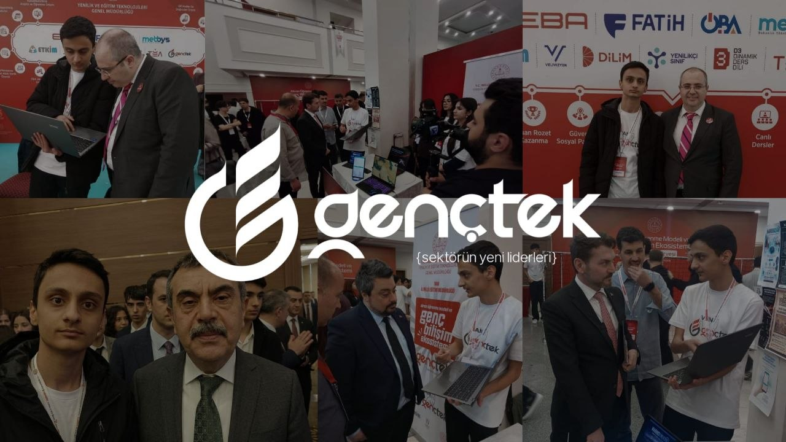

# 🚀 Team Archial

**Vision:** Building the ultimate Web3 "Everything App" — an Omni-Engine that aggregates the entire blockchain ecosystem into a single, AI-driven interface. Powered by GIWA Flashblocks, UP-ID, and Dojang.

---

### 👤 Furkan Akdoğan
* **Role:** Founder & Lead Web3 Product Developer
* **Nationality:** Turkey (🇹🇷)
* **Age:** 16

**🔹 Executive Summary & Background**
A 16-year-old Web3 prodigy with a relentless passion for decentralized systems. Growing up without a personal computer, I taught myself to code and researched Web3 protocols entirely from local internet cafes. At age 11, I made a $4k profit from my first major crypto trade, but my family confiscated the funds. Forced to rebuild everything from absolute scratch, I realized my true drive wasn't money—it was the profound freedom, censorship resistance, and decentralization that Web3 offers. This core ethos catalyzed my full immersion into building crypto infrastructure. Primary focus: **AI, Real World Assets (RWA), and Payment Systems.** Currently studying at Van İpekyolu Science High School, one of Turkey's top-tier institutions.

**🔹 Key Milestones & Experience**
* **Age 14:** Fully transitioned from a crypto-native user to a Web3 developer, diving deep into smart contract architecture.
* **Age 15 (TÜBİTAK Project):** Developed a blockchain-based political governance system for the prestigious TÜBİTAK competition, replacing the traditional parliament with a secure, decentralized architecture.
* **Age 16 (GENÇTEK Tech Summit):** Selected for the Tech Summit initiated by the Turkish Ministry of National Education. 

> 
> *GENÇTEK Tech Summit - Presenting Kletia to the Minister of National Education*

* **National Recognition:** At GENÇTEK, I presented the initial demo of **Kletia** (running on the Base network). The project was personally reviewed and praised by the Minister of National Education (Yusuf Tekin) and top general managers.

**🔹 Current Focus: Kletia & GIWA Ecosystem**
Scaling Kletia as the ultimate "Everything App" across 2 testnets (GIWA, Arc) and 2 mainnets (Base, Robinhood) with the vision of aggregating the entire blockchain into one seamless UX. By participating in the GASOK program, I aim to make Kletia the flagship AI aggregator of the GIWA ecosystem by deeply integrating **Flashblocks, Dojang, and UP-ID**.

**🔹 Core Strengths**
* **Visionary Architecture:** Designing complex Omni-App structures and Dynamic AI Contract Aggregators.
* **AI-Web3 Synergy:** Merging LLMs with blockchain states to execute zero-hallucination intents.
* **AI-Augmented 10x Execution:** Operating as a solo founder, I heavily leverage advanced AI models (like Gemini and Claude) as engineering co-pilots, allowing me to build, debug, and ship complex Web3 architectures at the speed of a full development team.
* **Rapid Prototyping:** Exceptionally fast at shipping MVPs on robust infrastructures like GIWA.

---

### 🤖 Kletia AI (Co-Founder)
* **Role:** AI Co-Pilot & Autonomous Agent
* **Nationality:** Decentralized (🌐)

**🔹 Experience & Strengths:**
* Embedded deeply within the Kletia workflow to assist with smart contract analysis and dynamic ABI parsing.
* Flawless semantic matching for intent execution, ensuring users can interact with complex DeFi protocols using simple natural language.
* Designed to interface instantly with GIWA's Dojang verifications and UP-ID queries to secure high-value intents.
