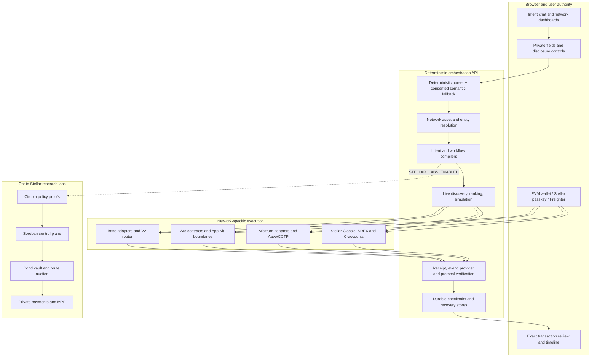
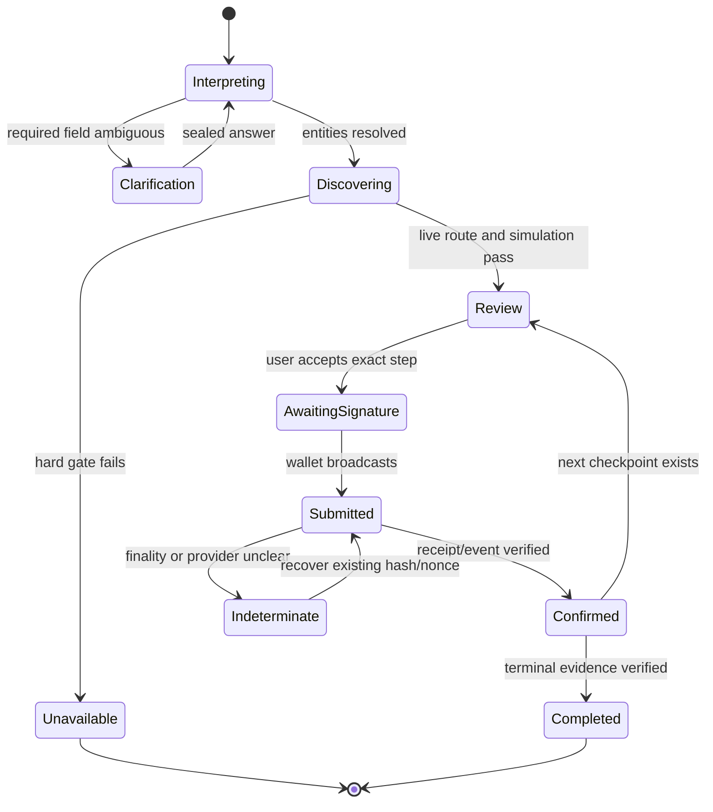

# Kletia architecture

## Product boundary

Kletia is one intent-driven application with four isolated network profiles and two capital lanes. It converts an outcome into exact network actions, asks the user to authorize every value-moving step, and advances only when action-specific evidence is verified.

| Profile | Network | Lane | Primary role |
|---|---|---|---|
| `base` | Base Mainnet (`8453`) | Production | Main DeFi, token launch, Basenames, x402, portfolio and security surface |
| `arbitrum` | Arbitrum One (`42161`) | Production | Capability-gated Uniswap V3/Aave expansion and staged Base workflows |
| `arc` | Arc Testnet (`5042002`) | Testnet | Native-USDC programmable-money protocols and CCTP source execution |
| `stellar` | Stellar Testnet | Testnet | Native payments/SDEX, passkey C-accounts, Payment Center, and opt-in research labs |

Arbitrum Sepolia (`421614`) is a reviewed Testnet execution endpoint for the Arc/CCTP/Aave corridor, not a fifth independent workspace. Production and Testnet assets cannot enter the same workflow.

Changing a profile changes wallet family, chain identity, asset catalog, action vocabulary, target registry, native-gas behavior, widgets, response validation, and executable state. It is not a cosmetic RPC switch.

## Layered system

### Runtime ownership

- `apps/web` owns the visible intent experience, local privacy controls, wallet/passkey sessions, stale-state invalidation, and final approval.
- `apps/api` owns canonical identities, intent interpretation, capability gates, live route construction, durable state, and evidence validation.
- `contracts/base`, `contracts/arc`, and `contracts/stellar` own independent compiler and deployment boundaries.
- `circuits/stellar-policy` owns reproducible Policy V1/V2 research artifacts.
- `render.yaml` is the canonical public-service topology; labs are disabled there by default.

## Intent and execution lifecycle

1. The browser binds the request to the active profile, account, and disclosure choice.
2. Deterministic parsing runs first. A semantic model is used only when permitted; its output is untrusted structured input.
3. Entity resolution maps symbols and addresses to exact network identities. Ambiguity creates a clarification, not a guessed transfer.
4. Adapters perform live discovery. Lane, chain, target, bytecode, asset, amount, deadline, quote freshness, privacy, and protocol capability are hard gates.
5. Supported routes are ranked using action-appropriate output, gas, fees, time, yield/risk, and disclosure costs.
6. The browser checks the response envelope against the current session and asks for the exact wallet or passkey authorization.
7. The API verifies receipt, event, amount, nonce, fill/refund, or protocol post-state before advancing.
8. Unknown finality enters recovery. The existing transaction is checked again; money is not resent automatically.

## Network execution boundaries

### Base Mainnet

Base is the broadest production capital lane. Its active swap boundary is `KletiaIntentRouterV2`, which combines EIP-712 intent binding, unordered nonces, deadlines, governance-enabled typed adapters, codehash checks, output balance deltas, fee caps, and residual-allowance cleanup. Discovery may be broader than onchain adapter execution; an observed quote source is not automatically authorized.

Lending, vault, staking, liquidity, token-launch, Basename, security, Across, and x402 flows keep protocol-specific target and evidence rules. A generic “trusted score” cannot override a failing identity, simulation, or spender gate.

### Arbitrum

Arbitrum One uses reviewed external protocol identities rather than a Kletia contract workspace. Uniswap V3 and Aave actions are gated independently in API and web builds. Borrow capacity uses live collateral, debt, liquidity, and oracle inputs and is not treated as permission to borrow.

Arbitrum Sepolia is limited to the reviewed Circle Testnet USDC/Aave corridor. The workflow verifies Arc approval and burn, Circle message/attestation, destination mint, Aave approval, and Aave supply as separate checkpoints.

### Arc Testnet

Arc owns its target allowlist, ABIs, response envelopes, and native-USDC rules. Kletia's native-value rail uses 18 atomic decimals, while Circle/App Kit ERC-20 rails use 6; conversion is action-specific and never inferred from the symbol alone. Arc contracts are Testnet deployments, not inherited Base protocols or production assurances.

### Stellar Testnet

Stellar is both a native execution profile and the home of opt-in research labs. Core flows include XLM/USDC balances, trustlines, direct Classic payments, SDEX path payments, and WebAuthn `secp256r1` contract accounts. A passkey controls a Stellar C-account through the pinned Smart Account Kit/relayer boundary; it is not an EVM private key or universal wallet credential.

The Payment Center coordinates SEP-1 discovery, SEP-45 contract-account authentication, SEP-38 quotes, SEP-24 user withdrawals, durable recovery, and exact Stellar transfer evidence. A provider must pass the configured corridor and real-settlement review; Testanchor remains reference-only and cannot turn release readiness green.

Policy proofs, control-plane commitments, solver bonds/auctions, shielded payments, and MPP remain labs. They add reproducible research value but do not execute Arc/EVM funds or prove a foreign-chain state transition by themselves.

## Custody and authorization

Kletia does not use one universal router for every financial action:

- EVM swaps may use a typed router adapter when target, spender, path, recipient, amount, and output semantics are supported.
- Lending, vault, staking, and liquidity calls execute from the user's wallet when an intermediary would change protocol ownership.
- Stellar C-account transactions require the matching WebAuthn credential; Classic operations may use Freighter.
- Policy or plan signatures authorize constraints and orchestration, not token transfer.
- Same-chain batching is atomic only when the wallet/contract capability supports the exact calls. A cross-chain workflow has no global rollback.

No user secret belongs in environment templates, source, logs, or browser storage. Operator deployment identities are separated from end-user accounts and runtime services.

## Evidence model

| Level | Meaning |
|---|---|
| `observed` | Data was read from a declared source; protocol truth is not yet established |
| `chain_native_verified` | The relevant receipt or ledger result was verified |
| `protocol_verified` | Expected protocol events, values, or post-state also match |
| `zk_verified` | The pinned circuit/verifier accepted the stated policy relation |

`zk_verified` does not prove a foreign EVM transaction. A hash does not prove the intended economic result. Provider status does not independently prove bank finality. The UI and documentation must preserve these distinctions.

## Failure and dependency model

- Missing RPC, bytecode, provider credential, deployment pin, durable store, or capability flag reduces or disables the affected feature.
- Provider errors do not become zero balances, fabricated APY, fixture routes, or mock success.
- Quote expiry requires re-quotation; a material economic change requires a fresh review.
- `submitted`, `failed`, `refunded`, `indeterminate`, and `recovery_required` are distinct durable states.
- External responses from models, RPCs, quote services, x402 endpoints, anchors, and relayers remain untrusted until their applicable checks pass.

## Extension rule

A new network or protocol becomes executable only after:

1. authoritative identity and asset metadata are added;
2. lane and runtime chain identity are verified;
3. live discovery and unavailable behavior are implemented;
4. an operation-specific transaction/XDR builder exists;
5. spender, recipient, amount, deadline, return value, and state-transition rules are validated;
6. simulation and receipt/protocol evidence are defined;
7. browser session and wallet bindings are tested;
8. documentation, readiness, and adversarial tests pass;
9. only then is execution enabled.

Use the [documentation index](../README.md), [repository structure](repository-structure.md), and [MVP test runbook](../runbooks/mvp-live-test.md) for implementation and release procedures.
