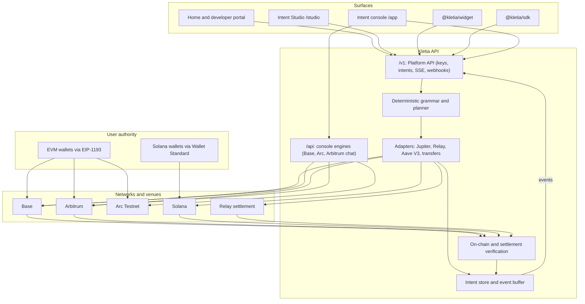
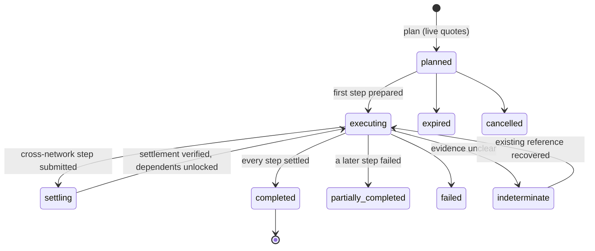

# Kletia architecture

## Product boundary

Kletia is intent infrastructure for EVM networks and Solana. It converts an outcome ("bridge 50 USDC from Base to Solana and stake it as JitoSOL") into exact, network-bound steps, asks the user's own wallet to authorize every value-moving step, and advances only when step-specific evidence is verified.

It ships in two forms that share one engine:

- **The Kletia app** — a home page, the intent console (`/app`), Intent Studio (`/studio`), a developer portal and a network status page.
- **The Kletia platform** — Platform API v1 (`/v1`), [`@kletia/core`](../../packages/core/README.md) (the intent specification), [`@kletia/sdk`](../../packages/sdk/README.md), [`@kletia/widget`](../../packages/widget/README.md) and [`@kletia/cli`](../../packages/cli/README.md), plus a read-only [MCP server](../platform/mcp.md) for AI agents, so other products can embed cross-network intents.

| Network key | Network | CAIP-2 | Lane | Primary role |
|---|---|---|---|---|
| `base` | Base | `eip155:8453` | Production | Intent Router V2 swaps, lending discovery, token launch, Basenames, x402 |
| `arbitrum` | Arbitrum One | `eip155:42161` | Production | Uniswap V3 / Aave V3, staged Base workflows |
| `solana` | Solana | `solana:5eykt4UsFv8P8NJdTREpY1vzqKqZKvdp` | Production | Jupiter swaps, liquid staking, transfers, Kamino discovery |
| `arc` | Arc Testnet | `eip155:5042002` | Testnet | Native-USDC protocols and Circle App Kit |
| `arbitrum-sepolia` | Arbitrum Sepolia | `eip155:421614` | Testnet | Circle Testnet USDC and Aave supply |
| `solana-devnet` | Solana Devnet | `solana:EtWTRABZaYq6iMfeYKouRu166VU2xqa1` | Testnet | Transfers and portfolio |

Production and testnet capital never share one intent. Changing a network changes wallet family, chain identity, asset catalog, action vocabulary, target registry and evidence rules — it is never a cosmetic RPC switch.

## Layered system

```mermaid
flowchart TB
    subgraph Surfaces[Surfaces]
      Home[Home and developer portal]
      Console[Intent console /app]
      Studio[Intent Studio /studio]
      Widget["@kletia/widget"]
      SDK["@kletia/sdk"]
    end

    subgraph Wallets[User authority]
      EVM[EVM wallets via EIP-1193]
      SOL[Solana wallets via Wallet Standard]
    end

    subgraph API[Kletia API]
      AppRoutes["/api: console engines (Base, Arc, Arbitrum chat)"]
      V1["/v1: Platform API (keys, intents, SSE, webhooks)"]
      Planner[Deterministic grammar and planner]
      Adapters[Adapters: Jupiter, Relay, Aave V3, transfers]
      Store[Intent store and event buffer]
      Verify[On-chain and settlement verification]
    end

    subgraph Networks[Networks and venues]
      Base[Base]
      Arb[Arbitrum]
      Arc[Arc Testnet]
      Sol[Solana]
      Relay[Relay settlement]
    end

    Home & Studio & Widget & SDK --> V1
    Console --> AppRoutes
    Console --> V1
    V1 --> Planner --> Adapters --> Store
    Adapters --> Base & Arb & Sol & Relay
    AppRoutes --> Base & Arc & Arb
    EVM --> Base & Arb & Arc
    SOL --> Sol
    Base & Arb & Sol & Relay --> Verify --> Store
    Store -- events --> V1
```

### Runtime ownership

- `packages/core` owns the shared language: chain registry, CAIP identities, assets, protocols, intent graph types, lifecycle rules, validation, events and webhook signatures. It has no runtime dependencies.
- `apps/api/src/platform` owns the chain-agnostic engine: grammar, planner, adapters, store, event buffer, settlement poller and the `/v1` HTTP layer.
- `apps/api/src/networks/*` own network primitives (RPC, assets, builders, verification) and the console's network engines. A network module never imports another network's targets or builders.
- `apps/web` owns presentation, wallet sessions (EVM and Solana), the cross-feature event bus, final review and the user's approval.
- `contracts/base` and `contracts/arc` own independent compiler and deployment boundaries.
- `render.yaml` is the canonical public-service topology.

## Intent graph lifecycle

```mermaid
stateDiagram-v2
    [*] --> planned: plan (live quotes)
    planned --> executing: first step prepared
    executing --> settling: cross-network step submitted
    settling --> executing: settlement verified, dependents unlocked
    executing --> completed: every step settled
    executing --> partially_completed: a later step failed
    executing --> failed
    executing --> indeterminate: evidence unclear
    indeterminate --> executing: existing reference recovered
    planned --> expired
    planned --> cancelled
    completed --> [*]
```

1. A request carries natural language or structured actions plus CAIP-10 accounts (one per VM is typical).
2. The deterministic grammar compiles text into actions. No model is involved in planning or execution; unsupported wording is refused with examples.
3. The planner resolves each action to exact network identities, picks an adapter, quotes it live, chains dependent amounts through guaranteed minimum outputs, and may merge a bridge followed by a destination swap into one cross-network swap.
4. Each step is bound to exactly one network, one account and one protocol. Steps form a DAG; a step becomes `ready` only when its dependencies settle.
5. `prepare` re-quotes and returns unsigned transactions (EVM calls or base64 Solana v0 transactions) with an expiry and a quote binding.
6. The user's wallet signs. The client submits the references (hashes or signatures).
7. The API verifies each reference on-chain: status, sender or fee payer equal to the bound account, target and chain. Cross-network steps stay `settling` until the settlement network reports a destination fill.
8. Every transition emits an event to SSE subscribers and signed webhooks.

## Network execution boundaries

### Base

Base is the broadest production lane. Its swap boundary is `KletiaIntentRouterV2`: EIP-712 intent binding, unordered nonces, deadlines, governance-enabled typed adapters, codehash checks, output balance deltas, fee caps and residual-allowance cleanup. The router, LaunchFactory V2 and Arc Vault V2 identities are public and pinned; they are re-validated against the live chain on every request.

### Arbitrum

Arbitrum One uses reviewed external protocol identities. Uniswap V3 and Aave actions are gated independently, and borrow capacity reads live collateral, debt, liquidity and oracle inputs without granting permission to borrow. Arbitrum Sepolia is limited to the Circle Testnet USDC and Aave corridor.

### Arc Testnet

Arc owns its target allowlist, ABIs, response envelopes and native-USDC rules. The native-value rail uses 18 decimals while the ERC-20 interface uses 6; conversion is action-specific and never inferred from the symbol.

### Solana

Solana primitives live in `apps/api/src/networks/solana`: portfolio (SOL, SPL and Token-2022), Jupiter quotes and swap transactions, transfers with idempotent associated-account creation, provider-instruction assembly (refusing any signer other than the fee payer), signature verification and Kamino rate discovery. Every prepared transaction is simulated before it is returned. See the [Solana guide](../networks/solana.md).

### Cross-network settlement

Relay settles EVM ↔ Solana and Base ↔ Arbitrum movements, including bridge-and-swap in one user transaction. Kletia verifies the source transaction on-chain and then polls the settlement network; a step is `settled` only on a reported destination fill, and `failed` on refund or failure. The console's staged Base → Arbitrum workflow additionally uses Across with destination fill verification.

## Custody and authorization

- Kletia is non-custodial. The API returns unsigned transactions; it never holds keys or moves funds.
- Every value-moving transaction is signed in the user's own wallet: EIP-1193 for EVM networks, Wallet Standard (`solana:signAndSendTransaction`) for Solana.
- Approvals are exact; an EVM approval is included only when the current allowance is insufficient.
- Same-chain batching is atomic only when the wallet supports the exact calls. Cross-network intents have no global rollback.
- API keys authenticate integrators; they never authorize value movement.

## Evidence model

| Level | Meaning |
|---|---|
| `observed` | Data was read from a declared source; protocol truth is not yet established |
| `chain_verified` | The receipt or signature status was verified with the bound sender or fee payer |
| `settlement_verified` | The settlement network reported the destination fill for the exact request |
| `protocol_verified` | Expected protocol events, values or post-state also match |

A hash alone never proves the intended economic result, and provider status never independently proves another network's state.

## Failure and dependency model

- A missing RPC, credential or deployment pin disables only the affected feature; `GET /api/capabilities` reports it as `needs_configuration` or `disabled`.
- An unreachable RPC degrades its network at startup; an RPC on the wrong chain stops the API.
- Provider errors never become zero balances, fabricated yields or mock success.
- Quote expiry requires re-preparation; a material change requires a fresh review.
- `submitted`, `settling`, `failed`, `indeterminate` and `expired` are distinct states; uncertain transactions are recovered by their existing reference, never resent.

## Extension rule

A new network or protocol becomes executable only after:

1. its chain, assets and protocol identity are added to `@kletia/core`;
2. lane and runtime chain identity are verified;
3. live discovery and unavailable behavior are implemented;
4. an operation-specific transaction builder exists;
5. spender, recipient, amount, deadline and output rules are validated;
6. simulation and on-chain evidence rules are defined;
7. wallet bindings are tested in the browser and the SDK;
8. documentation, capability reporting and adversarial tests pass.

See the [documentation index](../README.md), [repository structure](repository-structure.md) and [Platform API v1](../platform/api-v1.md).
