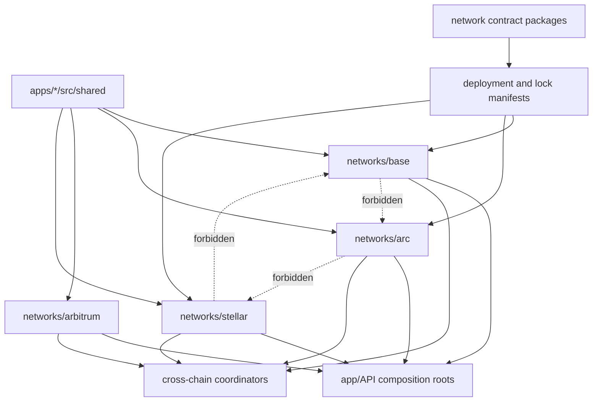

# Repository structure and ownership

Kletia is one product with four isolated network profiles, staged multichain workflows, and explicitly separated research labs. Directories follow runtime and trust ownership rather than feature history.

```text
apps/
  api/
    src/index.ts                    HTTP composition root
    src/networks/base/              Base-only adapters, assets, routes, security
    src/networks/arc/               Arc-only contracts, App Kit, and intents
    src/networks/arbitrum/          Arbitrum One adapters and readiness
    src/networks/arbitrum-sepolia/  Testnet Aave/Circle endpoint
    src/networks/stellar/           Native, passkey, Payment Center, labs
    src/cross-chain/                Sealed workflow versions and durable state
    src/shared/                     Parser, assets, policy, HTTP, safety, evidence
    src/integrations/               Bounded external-provider interfaces
    src/scripts/                    Operator and verification commands
  web/
    src/app/                        Application composition and global styles
    src/networks/                   Network-owned UI and wallet bindings
    src/cross-chain/                Staged workflow execution and timelines
    src/shared/                     Shared presentation, state, validation, privacy
    src/integrations/               External-service presentation boundaries
contracts/
  base/                             Base Solidity and Mainnet manifests
  arc/                              Arc Solidity and Testnet manifests
  stellar/                          Soroban crates, locks, and Testnet manifests
circuits/
  stellar-policy/                   Circom Policy V1/V2 source and dev artifacts
docs/                               Canonical docs, runbooks, and research records
tooling/                            Repository-wide verification gates
attachments/                        Immutable submission artifacts
.github/                            CI, issue forms, and pull-request policy
render.yaml                         Canonical public service topology
```

## Dependency direction



Network modules may consume shared primitives. They must not import another network's targets, ABIs, assets, wallet implementation, or calldata builder. Cross-chain modules coordinate typed network steps; they do not erase ownership boundaries.

## Ownership rules

### Shared code

`shared` contains reusable parsing, HTTP, state, validation, disclosure, and presentation primitives. It must not become an unreviewed global registry of protocol addresses or special cases. A change in shared code requires the full network intent matrix because all profiles can be affected.

### Network code

- Base code never imports Arc, Arbitrum, or Stellar execution code.
- Arc code never inherits Base targets or assumes an ERC-20 representation for native USDC.
- Arbitrum One and Arbitrum Sepolia keep production/Testnet identities separate.
- Stellar code uses explicit network passphrase, address type, issuer/SAC, wallet family, and passkey/Classic authorization.
- Each action owns its discovery, preparation, simulation, receipt, and recovery semantics.

### Cross-chain code

Workflow versions are compatibility boundaries, not interchangeable success paths. A value-bearing generic workflow may hand off to a reviewed executor, but cannot accept a generic transaction hash as proof. Production and Testnet steps cannot appear in the same plan.

### Contract and circuit workspaces

- `contracts/base` and `contracts/arc` have independent Hardhat configurations, lockfiles, compiler profiles, deployments, and operator environments.
- `contracts/stellar` is a Rust workspace whose deployment manifests and protocol locks pin Testnet identities.
- `circuits/stellar-policy` owns Circom source, public-input schemas, and reproducible development artifacts. Trusted setup and audit status must remain explicit.
- Generated build, cache, artifact, target, witness, zkey, and local wallet material must not be committed unless a verifier explicitly requires a bounded public artifact.

## Core versus labs

Core release modules are part of `npm run verify:core` and the default Render Blueprint. Policy/control-plane, solver market, private payments, MPP, and generic V3/V4 research surfaces require `STELLAR_LABS_ENABLED=true` plus the labs verification suite. A labs deployment manifest remains evidence of that Testnet contract, not a default product dependency.

## Path stability

The following paths are externally or cryptographically significant:

- `contracts/*/deployments/**` and Stellar lock manifests;
- `attachments/**`, whose paths and SHA-256 hashes are enforced;
- API/web composition roots referenced by deployment configuration;
- public assets referenced by the web application and documentation;
- circuit public-input schemas and verifier-linked artifacts.

Before moving one of these files, update every code, deployment, documentation, and CI reference in the same change. Attachment contents and paths must not change. Run both:

```bash
npm run check:structure
npm run check:docs
```

## Naming and generated output

- Application source and documentation are English; localized intent synonyms remain inside allowlisted parser/privacy sources.
- TypeScript filenames use camelCase or PascalCase.
- Package names are unique and package-local lockfiles remain authoritative.
- `node_modules`, `dist`, Hardhat artifacts/cache, Rust `target`, local databases, environment files, private keys, recovery bundles, and proving secrets are ignored.
- Operator scripts belong under the owning package's script directory and are not browser/runtime imports.

## Adding a feature

1. Choose the owning network or shared trust boundary.
2. Add canonical identity and fail-closed readiness before UI availability.
3. Implement deterministic preparation and action-specific evidence.
4. Bind the feature to both intent and manual review without creating a second execution truth.
5. Add happy-path, unavailable, stale, wrong-network, wrong-account, and recovery tests.
6. Update the owning README, architecture/status documentation, environment template, and deployment configuration if applicable.
7. Run the smallest package checks during development, then `npm run verify:core`; run labs or live gates when their boundaries changed.

The structural checker rejects deprecated package paths, network-crossing imports, generated output, mutated attachments, invalid deployment evidence, non-English application copy outside parsers, and other repository invariants.
