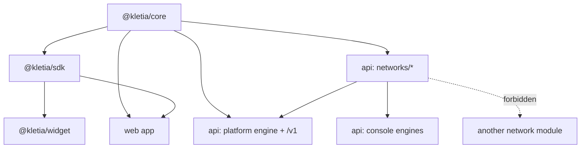

# Repository structure and ownership

Kletia is one npm workspace: a dependency-free intent specification, client libraries, an API and a web app, plus two independent Hardhat contract workspaces. Directories follow runtime and trust ownership rather than feature history.

```text
packages/
  core/                             @kletia/core: chains, CAIP identities, assets, protocols and
                                    pinned venues, intent graph, lifecycle, validation, events,
                                    webhooks, error catalog
  sdk/                              @kletia/sdk: v1 client (retries, idempotency), SSE, EVM/Solana
                                    signers, executeIntent; @kletia/sdk/server webhook handlers
  widget/                           @kletia/widget: embeddable React intent widget and hooks
  cli/                              @kletia/cli: the kletia command line
apps/
  api/
    src/index.ts                    Entry point (Vercel and Node); imports environment first
    src/http/app.ts                 Express composition: helmet, CORS (/api strict, /v1 open),
                                    limiters, route mounts, /v1 mount point
    src/http/server.ts              Startup attestation (degraded mode), shutdown
    src/http/routes/                Health and capabilities, console intent, on-ramp
    src/platform/engine/            Chain-agnostic grammar, planner, bridge auction, name
                                    resolvers, adapters (Jupiter, Relay, LI.FI, deBridge DLN,
                                    Aave V3, Compound V3, Morpho, Moonwell, Jupiter Lend, Kamino,
                                    transfers), verification, store, events, poller
    src/platform/http/              Platform API v1: keys, rate limits, idempotency, intents, SSE,
                                    webhooks and delivery logs, usage, venues, errors, badge,
                                    MCP server (mcp/), OpenAPI
    src/networks/base/              Base adapters, assets, routes, security, Intent Router V2
    src/networks/arc/               Arc contracts, App Kit and intents
    src/networks/arbitrum/          Arbitrum One adapters and readiness
    src/networks/arbitrum-sepolia/  Testnet Aave/Circle endpoint
    src/networks/solana/            Solana RPC, Jupiter, transfers, verification, Kamino
    src/cross-chain/                Console staged workflow (Base → Arbitrum, Across)
    src/shared/                     Parser, assets, policy, HTTP, privacy, environment, evidence
    src/integrations/               Webacy and Allora boundaries
    src/release/                    Readiness and capability reporting
    src/scripts/                    Operator and verification commands
  web/
    src/main.tsx                    Entry: egress guard first, then the router
    src/app/router.tsx              History router; every route is a lazy chunk
    src/app/routes/                 Route table, Link, ConsoleRoute (wallet providers + console)
    src/app/site/                   Site shell, design primitives, IntentGraphView
    src/app/pages/                  Home, Developers, Networks, Studio, 404
    src/app/App.tsx                 Intent console (EVM chat workspaces + Solana workspace)
    src/networks/                   Network-owned UI (Base, Arc, Arbitrum, Solana)
    src/shared/wallet/              Chain-agnostic wallet layer (wagmi + Wallet Standard)
    src/shared/sync/                Cross-feature event bus and activity store
    src/shared/platform/            Platform API client and hooks
    src/shared/                     Presentation, state, validation, privacy
contracts/
  base/                             Base Solidity and Mainnet manifests (own lockfile)
  arc/                              Arc Solidity and Testnet manifests (own lockfile)
docs/                               Architecture, platform API, networks, deployment, runbooks
tooling/                            Repository-wide verification gates
attachments/                        Immutable submission artifacts
.github/                            CI, issue forms and pull-request policy
render.yaml                         Canonical public service topology
```

## Dependency direction


```mermaid
flowchart TD
    Core["@kletia/core"] --> SDK["@kletia/sdk"]
    SDK --> Widget["@kletia/widget"]
    Core --> Platform[api: platform engine + /v1]
    Core --> Networks[api: networks/*]
    Networks --> Platform
    Networks --> Console[api: console engines]
    Core --> Web[web app]
    SDK --> Web
    Networks -. forbidden .-> Networks2[another network module]
```

- `@kletia/core` imports nothing. Everything else may import it.
- A network module may use shared primitives and `@kletia/core`. It must not import another network's targets, ABIs, assets, wallet implementation or transaction builders.
- The platform engine composes network modules through adapters; it never reaches into another adapter's private state.
- The web app talks to the API only over HTTP (the SDK or `fetch`); it never imports API source.

## Ownership rules

### `packages/*`

Published library surface. Changes are API changes: keep them backwards compatible, typed and tested (`npm run test:packages`). `core` stays dependency-free and runs in Node, browsers and edge runtimes.

### Network code

- Base code never imports Arc, Arbitrum or Solana execution code.
- Arc code never inherits Base targets or assumes an ERC-20 representation for native USDC.
- Arbitrum One and Arbitrum Sepolia keep production/Testnet identities separate.
- Solana code resolves tokens by mint and token program, builds only unsigned transactions, and refuses provider instructions that require any signer other than the fee payer.
- Each action owns its discovery, preparation, simulation, evidence and recovery semantics.

### Platform engine

The engine is the single cross-network intent engine. New venues are added as adapters with plan, prepare, verify and (for cross-network venues) poll. A step may only advance on evidence its adapter verified. Production and Testnet networks never share one graph.

### Contract workspaces

`contracts/base` and `contracts/arc` have independent Hardhat configurations, lockfiles, compiler profiles, deployments and operator environments. Generated build, cache, artifact and local wallet material is never committed.

## Path stability

The following paths are externally or cryptographically significant:

- `contracts/*/deployments/**`;
- `attachments/**`, whose paths and SHA-256 hashes are enforced;
- `apps/api/src/index.ts` (Vercel entry) and the Render build commands;
- public assets referenced by the web app and documentation (`apps/web/public/kletia-logo.png` is hash-pinned).

Before moving one of these files, update every code, deployment, documentation and CI reference in the same change, then run:

```bash
npm run check:structure
npm run check:docs
```

## Naming and generated output

- Application source and documentation are English; localized intent synonyms remain inside allowlisted parser and privacy sources.
- TypeScript filenames use camelCase or PascalCase.
- One root lockfile covers the workspace; contract workspaces keep their own.
- `node_modules`, `dist`, Hardhat artifacts/cache, local databases, environment files, private keys and recovery bundles are ignored.

## Adding a feature

1. Choose the owning package, network module or platform adapter.
2. Add canonical identity to `@kletia/core` and fail-closed readiness (`/api/capabilities`) before UI availability.
3. Implement deterministic preparation and action-specific evidence.
4. Expose it through `/v1` when it is an intent, so the app, SDK and widget share one execution truth.
5. Add happy-path, unavailable, stale, wrong-network, wrong-account and recovery tests.
6. Update the owning README, environment template, documentation and deployment configuration.
7. Run the package checks while iterating, then `npm run verify`.
